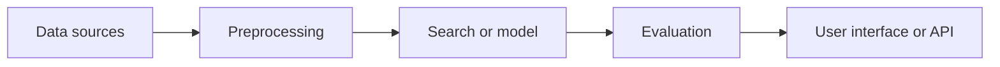

<div align="center">

# Dmitry Koriakin

### Machine Learning Developer

**RAG Systems** · **Search Quality** · **Biomedical AI** · **Python Services**

[](https://t.me/WinerGero)
[](https://github.com/WeinerGero)
[](https://github.com/WeinerGero)

</div>

<br>

<table>
<tr>
<td width="50%" valign="top">

## What I build

End-to-end ML and data systems that turn raw scientific or operational data into usable tools.

```text
Data -> Retrieval or model -> Evaluation -> Interface or API
```

</td>
<td width="50%" valign="top">

## What I focus on

- RAG and information retrieval
- Biomedical literature mining
- Data collection and preprocessing
- Search quality and answer evaluation
- Python APIs and local deployment

</td>
</tr>
</table>

---

## Portfolio map



<table>
<tr>
<td align="center" width="25%">

### 01

**Data**

APIs, XML, databases and raw text

</td>
<td align="center" width="25%">

### 02

**ML layer**

Embeddings, retrieval, ranking and LLMs

</td>
<td align="center" width="25%">

### 03

**Validation**

Metrics, error analysis and test cases

</td>
<td align="center" width="25%">

### 04

**Product**

Streamlit, REST API and local deployment

</td>
</tr>
</table>

---

## Featured projects

<table>
<tr>
<td width="18%" align="center" valign="middle">

# 🧬

[](https://github.com/WeinerGero/RAG-alzheimer-assistant)
[](https://github.com/WeinerGero/RAG-alzheimer-assistant)

</td>
<td width="82%" valign="top">

### [RAG Alzheimer Assistant](https://github.com/WeinerGero/RAG-alzheimer-assistant)

Local RAG assistant for searching PubMed literature on therapeutic targets in Alzheimer's disease.

```text
PubMed API -> XML preprocessing -> Vector Search + BM25 -> RRF
-> PMID grouping -> Mistral-Nemo via Ollama -> Streamlit
```

**What I solved**

- Combined semantic retrieval with BM25 to keep exact biomedical entities, including SNP identifiers, in the search results.
- Expanded each question into macro, micro and relational search strategies.
- Grouped retrieved chunks by PMID before generation to avoid filling the context window with one publication.
- Configured generation in Russian while keeping scientific entities and terminology in English.

[](https://www.python.org/)
[](https://pubmed.ncbi.nlm.nih.gov/)
[](https://www.trychroma.com/)
[](https://github.com/WeinerGero/RAG-alzheimer-assistant)
[](https://ollama.com/)
[](https://streamlit.io/)

[Open repository](https://github.com/WeinerGero/RAG-alzheimer-assistant)

</td>
</tr>
</table>

<br>

<table>
<tr>
<td width="18%" align="center" valign="middle">

# ⚙️

[](https://github.com/WeinerGero/task_tracker_API)
[](https://github.com/WeinerGero/task_tracker_API)

</td>
<td width="82%" valign="top">

### [Task Tracker API](https://github.com/WeinerGero/task_tracker_API)

Python microservice for managing one-time and recurring tasks in a medical scheduling context.

```text
Recurrence rules -> Templates -> Generated task instances
-> PostgreSQL -> REST API -> Swagger and tests
```

**What I solved**

- Modeled recurring schedules through separate templates and generated task instances.
- Handled dates that do not exist in shorter months by moving a task to the last day of the month.
- Stored variable recurrence rules in JSONB instead of adding sparse database columns.
- Added generation limits, date-range filtering, Docker-based local launch and automated tests.

[](https://www.python.org/)
[](https://www.postgresql.org/)
[](https://www.docker.com/)
[](https://alembic.sqlalchemy.org/)
[](https://pytest.org/)
[](https://github.com/WeinerGero/task_tracker_API)

[Open repository](https://github.com/WeinerGero/task_tracker_API)

</td>
</tr>
</table>

---

## Technical toolkit

<table>
<tr>
<td width="33%" valign="top">

### Data and ML


</td>
<td width="33%" valign="top">

### RAG and search


</td>
<td width="33%" valign="top">

### Engineering


</td>
</tr>
</table>

---

## Current direction

<table>
<tr>
<td width="33%" align="center">

### Improve retrieval

Hybrid search, reranking and evidence selection.

</td>
<td width="33%" align="center">

### Build applied systems

From raw data to a usable interface or API.

</td>
<td width="33%" align="center">

### Join an ML team

Open to Junior ML Engineer, Data Scientist and AI Engineer roles.

</td>
</tr>
</table>

---

<div align="center">

### Open to collaboration on applied ML, RAG and biomedical AI projects.

</div>
