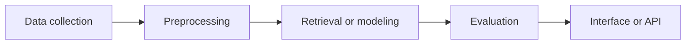

<div align="center">

# Dmitry Koriakin

### Machine Learning Developer

**RAG Systems** · **Search Quality** · **Biomedical AI**

[](https://t.me/WinerGero)
[](https://github.com/WeinerGero)
[](https://github.com/WeinerGero)

</div>

<br>

<table>
<tr>
<td width="50%" valign="top">

## What I build

**End-to-end ML and data systems** that turn unstructured scientific or operational data into working tools.

```text
Raw data -> Search or model -> Evaluation -> UI or API
```

</td>
<td width="50%" valign="top">

## Where I add value

- Retrieval and RAG pipelines
- Data collection and preprocessing
- Search quality and answer evaluation
- Python services and product-facing interfaces

</td>
</tr>
</table>

---

## How I approach ML projects



<table>
<tr>
<td align="center" width="25%">

### 01

**Data**

APIs, XML, databases, raw text

</td>
<td align="center" width="25%">

### 02

**ML layer**

Search, embeddings, ranking, models

</td>
<td align="center" width="25%">

### 03

**Validation**

Metrics, error analysis, test cases

</td>
<td align="center" width="25%">

### 04

**Product**

Streamlit, REST API, local deployment

</td>
</tr>
</table>

---

## Featured projects

<table>
<tr>
<td width="18%" align="center" valign="middle">

# 🧬

**RAG**

</td>
<td width="82%" valign="top">

### [RAG Alzheimer Assistant](https://github.com/WeinerGero/RAG-alzheimer-assistant)

Local RAG assistant for exploring PubMed literature on therapeutic targets in Alzheimer's disease.

**Pipeline**

`PubMed API` -> `Preprocessing` -> `Vector Search + BM25` -> `RRF` -> `PMID grouping` -> `Mistral-Nemo` -> `Streamlit`

**Why it is technically interesting**

- Preserves exact biomedical entities such as SNP identifiers with hybrid retrieval.
- Expands one question into macro, micro and relational search strategies.
- Removes repeated chunks from the same publication before passing evidence to the LLM.
- Produces Russian-language answers while preserving English scientific terminology.

`Python` `ChromaDB` `BM25` `RRF` `Ollama` `Mistral-Nemo` `Streamlit`

[Open repository](https://github.com/WeinerGero/RAG-alzheimer-assistant)

</td>
</tr>
</table>

<br>

<table>
<tr>
<td width="18%" align="center" valign="middle">

# ⚙️

**API**

</td>
<td width="82%" valign="top">

### [Task Tracker API](https://github.com/WeinerGero/task_tracker_API)

Python service for managing one-time and recurring tasks in a medical scheduling context.

**What it demonstrates**

- Recurring schedule modeling through templates and generated task instances.
- PostgreSQL migrations and JSONB recurrence configuration.
- Docker-based local launch, Swagger documentation and automated tests.
- Layered backend structure: API, services, repositories, schemas and domain utilities.

`Python` `PostgreSQL` `Alembic` `Docker` `pytest` `REST API`

[Open repository](https://github.com/WeinerGero/task_tracker_API)

</td>
</tr>
</table>

---

## Technical toolkit

<table>
<tr>
<td width="33%" valign="top">

### Data and ML


</td>
<td width="33%" valign="top">

### RAG and search


</td>
<td width="33%" valign="top">

### Engineering


</td>
</tr>
</table>

---

## Current direction

<table>
<tr>
<td width="33%" align="center">

### Improve retrieval

Hybrid search, reranking and evidence selection.

</td>
<td width="33%" align="center">

### Build applied systems

From raw data to a usable interface or API.

</td>
<td width="33%" align="center">

### Join an ML team

Open to Junior ML Engineer, Data Scientist and AI Engineer roles.

</td>
</tr>
</table>

---

<div align="center">

### Open to collaboration on applied ML, RAG and biomedical AI projects.

</div>
